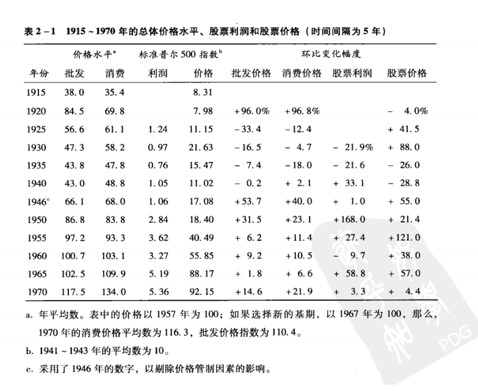

# 聪明的投资者

## 一、序言笔记

 格雷厄姆 给 进攻型投资者的三种策略建议

 1 购买相对不受市场追捧的 **大公司** 的股票

 2 买进被严重低估的便宜股票

 3 特殊情况（舆论，机遇）或 ‘破产债务重组’股票套利

 格雷厄姆主要买 被低估的便宜股票

 巴菲特发现 被低估的便宜股已经近乎没有了， 所以重点要去找 相对不受追捧的大公司，要去找那些 业务明了 业绩优秀 管理层经营能力非凡，为股东着想的大公司

***（我的总结）***
***（就是 有前景 盈利不错 管理层是精英【如：高学历或者从过政】 且与 大股东深度绑定）***

一句话：我们寻找的是一个持续具备竞争优势并且由一群既能干又全心全意为股东服务的人来管理的企业。

巴菲特指出 ：任何人定期投资指数基金，即使什么都不了解，通常都可以打败大部分专业的经理人，因为这些经理管理的基金占市场大头，所以他们的平均业绩水平就几乎等于整个市场的业绩水平

## 安全边际--投资中最根本的、最基本的原则

一定要遵从安全边际   这也是格雷厄姆不断强调的

目的：让人能够安心 

有了足够的安全边际，就不希望疲于分析公司的未来，投资者就会认为公司未来不会远远低于过去（20章着重讲解）这就好比：用四毛钱买了价值一块钱的股票，这样即使下跌百分之50 那也就亏了一毛钱

## 情绪--投资最重要的因素

发现一个好公司容易，找到一个很有安全边际的好公司也不算难，难在情绪不能被市场左右
无论大盘还是小盘，市场总会大大低估一个优质股票，导致股票下跌，这时候需要的就是保持冷静，反之亦然因为市场今天的表现有很多因素，而公司的表现因素不多，不能把行情等同于实际价值要冷静的判断出好的股票，并且判断出其价值远大于当前市值，在他低价的时候果断的买入，即使明天后天大后天都在跌也需要保持冷静。

**要让市场服务自己**

格雷厄姆强调：如果你都不能确定，你对这个公司的估值远远大于市场先生（拟人，类似 市值就是整个市场的估值），那你就不要选择投资了。就像打扑克一样，打了30分钟都不知道谁不聪明，那么那个不聪明的人就是你了。

总结：投资看自己 不要看市场波动，单纯技术分析具有局限性。
*格雷厄姆：股票 短期是个投票机器，长期是个称重机器*

巴菲特和芒格分析流通股票投资是否成功，看的是这个公司的业绩，而不是市值。
“在别人贪婪时恐惧，在别人恐惧时贪婪

## 控制情绪的思考框架

究其根本在于情绪
巴菲特：书本重点在于 第八章和第二十章

## “防御型”和“进攻型”投资者

防御型投资者： 
              
              1 最重要的原则---避免重大错误和风险

              2 不付出过多努力（时间成本低）

进攻型投资者： 
  
              1 愿意花时间研究更好的股票，投入大量时间成本和精力
             
              2 期望很高，足够乐观

## 行业增长与市值

事实上，行业发展快，不一定是好事。

如果过于激进的发展，很可能导致产能过剩，经济效益低 那么市值很可能下跌比如航空股票，航空股在以前是被重点看好，可事实是表现很糟糕反过来，市值的飙升对业绩和企业的发展，不一定会产生很大影响

***（这里我认为）（高科技产业向来如此，不是砸钱就能成功的，这也是为什么，巴菲特看中的是 公司的人才，管理层能力。而不是单纯的市值，走线，数据分析还有业绩。）***

## 价值几何

找到价位平衡点尤其关键，在股价被低估时看好他 在股价被过分高估时，理应抛出
一定要考虑到，这个公司真正的价值有多高,对于 成长性极强，未来价值远大于净资产的公司 与 市值和净资产比较匹配的公司 相比较 后者的收益可能往往比前者更高，因为前者会受到股市波动而被影响发展

对于投资而言 普通投资者花一点点功夫也能有不错的成绩， 但是如果想再向上提升，就需要花极大的时间成本、学习成本。 千万不要妄想: 花小功夫就能得到远超预期的收益

## 投资方法的重要性

1 不要妄想自己能远超平均水平的收益，绝大部分专家都无法做到,更需要想的是 如何做简单证券组合（在购买多个高等级债券同时 也要持有一组 多样龙头股）

2 *不要逾越安全区域，不要去冒险投资*

3 **投资方法一定是建立在安全边际原则的基础上**

4 并且强调本书 对于任何 储蓄、定存、贷款、保险、不动产抵押、股权投资等理财方式*都不讨论* ,本书的 “现在” 是指1971年底 或者 1972年初

# 第一章 投资与投机：聪明投资者的预期收入

## 投资与投机

投资与投机的区别在于：投资是 深入分析为基础，确保本金安全，并获得适当的回报；不符合这个要求的则是投机。

*卖空：股票投资者当某种股票价格看跌时，便从经纪人手中借入该股票抛出，在发生实际交割前，将卖出股票如数补进，交割时，只结清差价的投机行为*

不能把大部分股民的*投机行为*所导致的亏损归咎于股票买卖，格雷厄姆认为华尔街等券商应该警示股民的投机行为。

投资和投机都有可能亏损，投机也可以有智慧，但大部分人的投机都是愚蠢的，尤其是（1）认为自己在投资，实则投机（2）在缺乏足够知识和技能的情况下，把投机当作一种智慧，而不认为这是运气（3）投机的投入过多，超出了自己承担亏损的能力。

格雷厄姆认为：（1）所有非专业人士的任何保证金交易都是一种投机，并且投资人有义务对此加以提示。（2）任何抢购“热门”股票或类似行为的也是在投机或者说赌博。（3）投机在小部分资金范围是合理的，而且最好单开一个账户（避免因为上涨而加大资金）

## 防御型投资者的预期投资结果

简单定义：防御型投资者就是 关心资金安全且不花过多时间和精力投资的人

曾经格雷厄姆建议，25-75%的证券投资，股票与之适应（高等级债券和蓝筹股）

***注**：蓝筹股：长期稳定增长的、大型的、传统工业股及金融股。“蓝筹”一词源于西方赌场，在西方赌场中，有三种颜色的筹码、其中蓝色筹码最为值钱。证券市场上通常将那些经营业绩较好，具有稳定且较高的现金股利支付的公司股票*

*高等级债券：高于其他债券级别的债券。由摩迪氏证券服务公司或标准普尔公司确定的等级，一般来说，质量高的债券是信用好的债券*

或者 各占一半，随市场情况控制在5%内变化，还有一种是在市场高位的过于危险时候，将股票减持到25%，当股价低到不可拒绝时，提升到75%

数十年的统计可以证实，证券的价格无法预测，债券的波动很大概率是低于普通股票的，优质长期债券的本金下跌是货币市场的变化导致的，如利率。国债不需要担心市场缩水，因为利息是会偿还的。

## 防御型投资者的预期（1971-1972）

在不出现重大负面的情况，投资者至少可以获得3.5%的股息＋平均4%的股票增值收益，税前股票总收益约7.5% 略低于 高级债券。 税后5.3% 于 优质免税中期债券收益相同

优质债券的利息和本金偿还的可靠性，远远大于股票的股息和股价增值，所以至少在1971-1972这左右的时间，投资债券是比股票要更加有利。

但是这不是百分之百的，如果考虑到通货膨胀则有不同的可能。（1）如果通货膨胀速度变快，那么股票资产比证券有吸引力。（2）另一种可能，企业利润大大增加，而且没有通货膨胀，那么股票将大幅度增长。（3）并且也要考虑股票市场出现投机浪潮（可能是由舆论激起的），那么股票也会大涨。

所以把百分百资金投入债券中，是不合理的，一定要分配比例。

5.5%的年收益，在常年看来是很高的，虽然1949的后20年的牛市高达14%投资回报，但是从道琼斯工业指数看，上涨了4倍，可公司利润和红利大约只有1倍，*这种情况属于投资者和投机者的态度变化，而不是公司内在价值的飙升。话句话说，这是股市的自我膨胀，是经济泡沫。*

# 格雷厄姆 绝对的忠告建议：

*不能*期望通过买任何新股 和 热门股 能够获得优于市场平均水平的收益

## 防御型投资者的建议
防御型投资者：只应该买 长期利益记录 和 财务状况非常好的 龙头公司股票。（好到足以让任何投资分析者去为这公司开清单）

第一、可以先买入一个 地位稳固的基金

第二、利用 共同信托基金（common trust funds） 和 混合基金(commingled funds) 若资金过大，聘用一家知名的投资咨询公司。

第三、美元成本平均法： 固定一个周期（每月或每季度） 投入固定的资金， 也被称为程式投资（formula investing）

前文提到的 股票比例在25%-75% 并根据市场调控就是用的这个思路。

## 进攻型投资者的建议

格雷厄姆对以下投资方法*给予否定*

1、择时交易 在股票上升时买进，跌落时卖出

2、短线择股 买进 报告或预计业绩增长，或有其他利好消息的公司股票

3、长线择股 购买 尚未取得成绩，但预计会高盈利的公司股票  

***上述都被称之为投机行为***

解释：第一种公式打法是行不通的，股票的“上升”和“跌落”很可能在一瞬之间，不能通过一个因素就下决定

第二种 如果真能够预测 次年的业绩的话，那么这个公司一定是“热门股票”

第三种 长线的难度远远大于短线，因此 预测出错的概率极大。 长期投资是最专业的分析师所擅长的，普通投资者根本不可能在预测能力上胜过市面上的专业分析师，此时进攻就是鲁莽的选择。

### 进攻型投资者的机会：

别人的投机，市场是不够“冷静”的，往往价值与价格的差距很大。这就是进攻型投资者需要利用的。当能够判断出股票具有的潜力，就能够低买高卖，不过者需要专业的分析和足够的经验，当然，精力和时间必不可少

甚至可以去卖空一个被高估的股票，这比上面的难度还要高得多，需要足够的胆略毅力和财力。

## 1949年 横跨75年的总结公式（如今不适用）

罗斯柴尔德行为法则应用：

 根据 利润和当期利率，可以确定买进和卖出道琼斯成分股的价格水平
**（在价格低于“中心”价值或者“内在”价值时买入，在高出时卖出）**

贱买贵卖，与华尔街一贯的追涨杀跌截然不同，1949年后不再适用。
因为这种机会过于好，所以大家都默认不会存在，格雷厄姆自己的证券投资中，就发现了不少售价低于净流动资产（营运资本）本身的价格（不包括厂房等其他资产,扣除求偿权优先于该股票的所有债务）

这时候证券的卖价远远低于其作为非上市公司的价值，任何股东业主都不应该这样低价出售股份，但是格雷厄姆发现并不少，不过随着时间慢慢消失了。
***（ 个人观点）（卖低价股票，在目前来看可以吸引投资者，促进买卖，鼓励交易，未尝不是一种策略）***

总而言之，找被低估的股票，在它被高估的时候卖出。（这是合理且是属于价值投资，因为能够买低估的股票，本身只能从价值出发）

## 第一章点评

格雷厄姆： 投资者 根据公认价值标准判断股票市场价格
          投机者 根据股票价格确定价值标准

投资者对股票走势不那么关注，*只有在* 即使不知道股票每日价格，你对你的股票依然放心 **才选择购买**

投资者是为自己赚钱，投机者为经纪人赚钱。这也是为什么华尔街总贬低脚踏实地的投资。

## 傻瓜四部曲 （投机）

1990年代 

有这四步骤

1 在道琼斯工业指数的成分股中找出价格最低且股息最高的5个股票

2 去掉价格最低的那个

3 把四成钱投入到价格第二低的股票

4 其余三只各 两成

5 一年后重新筛选5个

6重复上述做法，一直到富翁

这是非常典型愚蠢的投机行为
股票未来表现，单纯看公司业务好坏（这里强调，是包括宣传营销的）

# 第二章 投资者与通货膨胀

通货膨胀会使得现金变得也不安全，股票的红利和上涨有一定抗通胀能力。

当年美国金融一致认为： 
                1 债券本质是不可取的投资

                2 股票比债券要更可取

甚至有人建议 慈善机构的投资组合 应该全部都是股票

但是 再优质的股票也不可能在所有情况下优于债券所以不能只依靠股票
相反也是 不能只依赖证券

## 用不同的衡量标准来观察通货膨胀

从以往经验看，对于美国

1965年以来发生的最严重通货膨胀

1915-1970（55年）：

在1915-1920生活费上涨一倍，1965-1970之上涨了 15%

3次价格下降期 6次不同程度的价格上涨，其中有几次上涨幅度非常微弱，可以看出今后仍然会继续通货膨胀

过去20，消费价格 每年平均上涨：2.5%，1965 - 1970 ：每年平均：+4.5%，1971：+5.4%

上涨幅度意味着 生活费用提高，将会让中期免税优质债券（高等级公司债的税后）*利息*折半

格雷厄姆举例出人们大量的问题：

1 买入并持有高等级债券以外的证券，是否会有更好的收益

2 全资股票不比部分股票部分债券更好吗

3 股票不是具有内在保护机制，可以抵御通胀吗？

4 长期看，股票收益不是必定大于债券吗

5 55年的统计，统计学上不是股票收益远远高于债券吗

道琼斯指数从1915年 77点上涨到1970年的753点，年复合增长率：4%，还有大约4%的股息（标普情况类似）。两者相加近8%的收益

这表现优于债券但是低于高等级债券

*所以未来普通股一定远超过去55年的表现吗*

***格雷厄姆对此给予否定***
普通股即使表现得更好，但是确定性很差。从长期角度（25年）和中短期（小于5年）来看，投资者得财务和心理状态也是在变得

换句话说，尽管宏观上长远看，股票会表现优越，但是对于个人情况而言，微观层面，就需要忍受或者遭遇很多问题了。

每一步打算都是，年复一年得经历来决定，而不是通过归纳以往来投资的。自己的想法，希望，担忧等等都会影响实际投资

格雷厄姆认为，通货膨胀或者紧缩状态与普通股票的利润和价格之间*不存在强相关*

## 通货膨胀与公司利润

需要观察美国的资本利润率
发生通货膨胀，公司的利润明显下降，道琼斯成分股的市值远远高出账面值

公司的每股收益和通货膨胀没有直接的影响，因为股票的利润都是投资后得到利润再投资所形成的资本大幅增长。想在通货膨胀的情况下促进股票价值，唯一可能就是提升企业投资的利润率。 

**我的理解）（通货膨胀不影响股市本身，你只有套现完消费后，你的资产才会被通货膨胀所影响）**

格雷厄姆：从经济周期的情况来看，企业好年景和通货膨胀是同时出现的，怀年景与价格下跌如影随形，持续的繁荣和物价上涨是 相辅相成的。（至少在1950-1970年相一致）

但是 通货膨胀对股本盈利影响不大，主要因素

                    1. 工资的增长超过了生产率的增长
                    2. 对巨额新增资本的需要，压低了销售额与投入成本的比例

1950-1969
公司总体债务增长四倍，经济学家和华尔街却不怎么关心，利率大大增加的情况下，债务就成了很重要的负面经济因素。对于许多公司而言，是很大的麻烦。

对于股市，公用事业单位是通货膨胀最大的牺牲者。1、债务成本大幅上升 2、因为价格管制原因，服务价格很难提高。 当然，电力、天然气和电信服务的单位成本的增长，远低于同期价格指数，这使得这些公司在未来处于很强的战略地位。

回看之前的观点：投资者不应该期望道琼斯成分股能够获取高于8%的总体平均回报。可事实则是被大大低估，注意！！这个低估不是指的你投资的股票，是总体的。

可以肯定的是：股票组合的利润和年均市场价值，不会统一的按照4%增长。
依照今天和明天的股价去购买股票，很可能数十年都无法得到满意的回报。好比1929-1932股市崩盘，通用电气的股票费时25年才回本。

所以，投资者如果把所有资金全部用来买股票，就很容易被市场情绪带动导致误入歧途。这时尽管牛市真的来了，投资者或者说投机者 不会把大幅上涨看成 下跌风险的提高，这就会错失良机。

个人总结：通货膨胀会导致总体股市的投机性增强，需要非常谨慎的看待，尤其不能all in股票，在不稳定的经济发展下，更要对牛市警惕。

## 股票以外的防通货膨胀办法

### 购买黄金

这是世界各地通货膨胀时 保值的策略。

事实上，这并不靠谱，比如 1935-1972 ，三十多年 从35美元一盎————到58美元一盎司，在此期间 黄金持有者没有任何资本收益，还得付出维护费。可如果他们选择定存银行，收益也比这高。

黄金等许多贵重物品如：钻石、画作、头版书、收藏的邮票、钱币等。 
绝大多数情况都是人为炒作的，不可靠的，不真实的。

格雷厄姆很难承认 用67500美元买一个1804年（且不是当年铸造）的硬币 这个是一种"投资行为"。当然他也承认自己不是这行的专家，不过很显然是有一定道理的。

房地产也被认为是长期投资，但是投机性极强，房价受人为主观因素影响深刻，大量的房产商误导等因素都会导致错误的购买。当然格雷厄姆仍然表示自己不是这行的专家，但也告诫读者 自己要熟悉这行在做出投资。

### 格雷厄姆的总结： 

投资者不应该把资金集中于一处，债券和股票需要按一定比例分配

投资者越依赖自己靠投资组合 产生的依赖（靠投资谋生），就越要预防出乎意料的结果包括生活的不稳定。防御型投资者，理应把风险最小化。

完全持有债券的风险 远大于 按比例投资债券和股票，当然也要留有属于投资的现金。

# 第二章点评

很多人认为通货膨胀无需理会，很大程度上是因为货币幻觉

比如年收入上涨2%，通货膨胀率为4%，事实上这和收入减少2%的情况是一样的，不过主管的看，工资上涨是会给予一定心理暗示，让自己觉得过得更好了。对于物价，薪资变化的感觉会更加明显。

所以衡量财富一定要扣除掉通货膨胀的那一部分，通货膨胀时时刻刻发生在我们身边。

上文说的股票抗通货膨胀，需要的忍耐度很高，不确定性也很高，从1926-1930，1927-1931，。。。，-1998-2002，50个五年期 有78%的股票收益超过同期的通货膨胀率。这比例相当不错，但不完美

还有两种补救方法：

1、REITs,Real Estate Investment Trusts——不动产投资信托

指 拥有商业和住宅房产，并收取租金的公司。 通过与房地产共同基金结合

2、TIPS---Treasury Inflation-Protected Securities——通货膨胀保值国债

美国政府于 1997年发行的一种债券， 所有国债都不存在逾期不还的风险。TIPS还能保证你的投资价值不受通货膨胀影响

需要注意的是，TIPS的价值随通货膨胀增高而增加后，国税局会认为 这种增值是应税所得。
为什么？不要问官僚机构为什么，这就是规矩。

把10%退休资金投入到TIPS是一个明智的选择。

# 第三章 一个世纪的股市历史

## 1972年初的股价水平

个体投资者或者说散户 相对整个股市 非常渺小。为了减少不必要的风险
**了解股市历史则是不可或缺的**

特别是 关于 价格的重大波动，以及股价整体水平与股票利润和股息的各种相关知识，这样就具备了一定的判断能力

1871-1971（前半世纪数据相对不完整可靠，但也能近似估计作为参考）

目的如下：

                1、说明过去一个世纪的股票，是必定是周期性的反复上升
                2、用10年期的平均值 来显示市场状况，包括股价，利润股息
得出三个重要因素的各种不同关系

并用如此丰富的背景资料预测1972年的股市

原文给了两张图和一个曲线

第一张给出 这百年 19次牛市和熊市的最高最低点位，采用两种指数

                1、Cowles考勒斯研究的指数，标准普尔500指数前身
                2、道琼斯工业平均指数（DJIA）由29家大型工业公司和一家美国电话电报公司组成

曲线是标普公司提供的，显示了工业指数 1900-1970的波动情况

不难看出分为三个阶段 
                 1、1900-1924 
                 2、1925-1949 
                 3、1950-1968

1阶段 由一系列的 3-5年市场周期组成 年均上涨仅仅3%，随后进入到牛市

2阶段 1929年达到牛市顶端，随后就是股市大崩溃年均上涨1.5%，此时大熊市让股民对股票兴趣荡然无存，但这也是契机。

3阶段 有史以来最大的牛市，1968年到达顶峰 在这牛市中 56-57 61-62 曾出现比较大的跌幅，但随之而来的是大增幅，那么这可以算是牛市中的回调而不是单独一个周期。

1963年出现了14%以上的收益记录，后来被广泛研究，华尔街以此引以为傲，并期待未来也能有如此之高的收益

## 股市波动与投机性

但是！！这结论显然是很冲动的，危险的。在这样上涨的情况意味着，投机性非常的大，股市绝大部分人无法判断股市涨过头了。这时候非常容易崩溃，随后标普指数就下跌了36%。

1939-1942 跌幅达42%， 反映了珍珠港事件的不确定性和风险担忧。不过在1970年5月又开始上涨，在1949-1970 平均年增长9%，非常的高。但后十年却低得多只有3%

此外还得统计利润和股息的情况

十年期可看出：各年的波动区域平滑，持续上涨。就利润和股价平均水平而言只有1891-1900 1931-1940是下降的，其余十年平均利息从未下降，但增速不一致，经历过二战后表现比较强劲。

需要注意的是，1970年，美国公司整体利润下滑严重，资本利润率下滑到二战以来最低，相当多公司亏损且陷入财务危机，大量公司进入破产程序。 大繁荣在1969-1970结束

1949年6月标普指数的市盈率为公司的6.3倍到1961年 变成了22倍。 股息从7%降为3%，与此同时高级债券从2.6%变为4.5%。

这显然是不合理的，预示着大麻烦的不祥之兆，但貌似并没有发生

## 1972年年初的股价水平

1972年1月 道琼斯：900 标普：100
### 格雷厄姆对走势的判断
格雷厄姆在各个时间点对指数的分析：

1948，道琼斯：180 保守看也是很低的 ———— 1953年 道指：275 5年涨了50%，格雷厄姆抛出疑问，对于保守稳健的投资这是否过高了？ 从价值含量来看，53年仍然算合理，但上涨程度远超大部分时间，到达历史新高。

此时混合型投资（债券与股票分配投资），应该是风险化最低的，但在“预言家”或者说“上帝”看来这是愚蠢的，厉害的人应该能预言未来五年指数上涨一倍。但这符合逻辑吗？ 

格雷厄姆认为，在未来预测中，他们（指格雷厄姆的团队）认为自己是最符合逻辑的

1959年 道指已经创出有史以来最高点，此时格雷厄姆 不得不认为 目前股价水平极其危险，即使没有下跌，市场自身动能（惯性）会把股价推向不合理的高度

此时，真正验证了格雷厄姆的看法，1961年从685到566（格雷厄姆曾预测跌到584） 1961年底冲到 735 ————1962的五月下跌到536点，6个月下跌27%，广受追捧的“成长股”跌的最狠

尤其龙头股IBM 从1961.12的607usd—————到1962.06的300usd

大量“热门股”涌现 并 跌幅近90% 乃至更多， 这对 自主的投机者 和 自认为是“投资者”的莽撞之人来说 即使不是灾难，也足以令其惶惶不安。

当然股价复苏和上升也非常显著 
1964.11 道琼斯指数：892 标普500综合：86.28

### 格雷厄姆再次评估其股价水平，并得出三点主要结论

1、原有的价值标准似乎不再适用，新标准尚未经历时间考验

2、投资者必须根据重大不确定因素考量，规划投资策略，要考虑极端情况

3、如果1964的指数还不算过高，那就没有任何过高的点位了

对于防御型投资者在1964年情况下应该采取

1、不要借钱购买或持有证券

2、不要增加购买股票的资金所占的比重

3、减少股票持仓量，降低至总投资的50%以下。要尽可能利用资本利得税方面的优惠，把资金投入到高等级债券 或 储蓄存款

可以证明，这是合理的，道指在上涨至995点后 又反复下跌到 1970年的 632点，在同年底收于839点。

"热门股" 再次遇到崩盘————下跌幅度达90% 与1961-1962年的下挫完全一致，此时金融领域开始消沉和疑虑。

综上所述，格雷厄姆的判断也是相当准确的，除了1953年过于保守。

劝告：一方面，倡导一致可控的投资策略，同时，也不鼓励“战胜市场”，“挑选赢家”的做法。

金融分析的工作处于 雄辩家和数学家之间，逻辑和感知要自洽

### 债券利率和股票市盈率

1971.10 股市近三年市盈率低于1963和1968年底数据 与1958年相当

与债券收益 相比 1971.1的股票市盈率 趋于恶化，上一年反而股票是债券两倍收益，今年反而倒转，甚至两倍还多

总而言之，以三年平均利润为基准，债券收益与股息收益相当，保守看，股市的价值比想象中要低

## 第三章点评

### 牛市呓语

*格雷厄姆展现了他的预测才能*，成功预见了1973-1974的“灾难性”熊市——股市下跌37% ，同时揭穿了20年后的市场大师和畅销书作家们的伎俩（格雷厄姆时期没有的伎俩）

**聪明的投资者绝对不能只靠过去的推测来预测未来，去想当然**

比如 20世纪90年代开始，自认为饱读经书的投资者们大放厥词，出版了《道指36000点》道指40000点》《道指100000点》
（注意：2025.3.36 道指：42543）

他们根据历史**断定**未来股票必定大于证券，股票在过去30年里“总能”战胜债券，所以风险一定比债券小，甚至比存银行还小。 在1999-2000年年初，关于牛市呓语随处可见

多数所谓专业的投资经理，投资分析师都一味的吹捧股市价值。结果，比较出名的几位，在2000-2002都遇到了滑铁卢。

*Firsthand共同基金经理*：兰蒂斯最看好的无线通信股——诺基亚 下跌67%，推崇的winstar公司下跌99.9%

*Kemper基金投资战略分析师*：罗伯特最看好的思科系统公司和摩托罗拉——2002年暴跌70%以上，投资者们**仅在思科**这一直股票上 损失就**高达4000亿美元**，比当时中国香港，以色列，科威特和新加坡的4个地方的国民生产总值加起来还多

*时任雷曼兄弟公司投资分析师*：杰弗里提出：仅仅因为股市总体价格比两年前更高，就能说明股市风险变高了吗？ 

随后从2002年4月 道指：11187 纳斯达克指数：4446
到2002年年底 道指：8300点上下 纳斯达克：1300（连续六年涨幅荡然无存）

### 爬的越高摔得越狠

对于这种牛市癔症，格雷厄姆提问：

为什么股票的未来回报总是与过去相同？
如果所有投资者达成共识，认为股票长期必定赚钱，那么是不是说明股价会被高估呢?

格雷厄姆的理性与逻辑总是经得起推敲，尽管20世纪90年代末，公司盈利欣欣向荣，世界大部分地区处于和平，也不意味着就能够买任何价位的股票。

### 乐观主义的局限性

期待高收益能够延续，是一种很危险的想法。

1995-1999：美股平均每年上涨20%以上，在美股历史都是前所未有的高速增长。

此时的股民又变得乐观了起来

1998年中期：盖洛普公司调查投资者预期，其股票未来一年平均收益在13%，2000年初，这个数字变成了18%

“资深专家”同样乐观过头了，2001——SBC通信公司将养老金的预期收益率从8.5%调高到9.5%。到2002年标普500的成分公司的养老金计划的平均回报率在9.2%（最高纪录）

随后发生了可怕的后果，盖洛普发现2001-2002，投资者预期下降至7%，华尔街估计，各公司的养老金收益将付出至少320亿美元的代价

投资者都知道低买高卖，但结果总事与愿违

**格雷厄姆指出：由于物极必反的原则，投资者越看好股票长期走势，短线出错的可能性就越高。**

2002.3.24 美国股市总值14.75万亿美元峰值，30个月后，降幅达50.2%，仅为7.34亿美元，7.41亿化为乌有。

此时，市场的权威人士又变得非常悲观，他们预计今后几年甚至几十年，股市将平平无奇，甚至负的回报。

此时，格雷厄姆又提出了一个问题：**居然“专家们”上次判断如此糟糕，聪明的投资者们现在为什么要去相信他们呢？**

